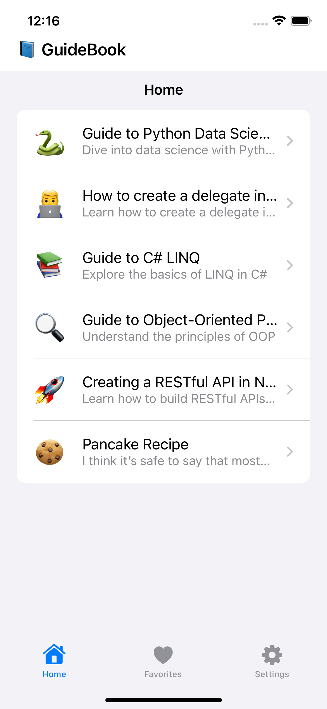
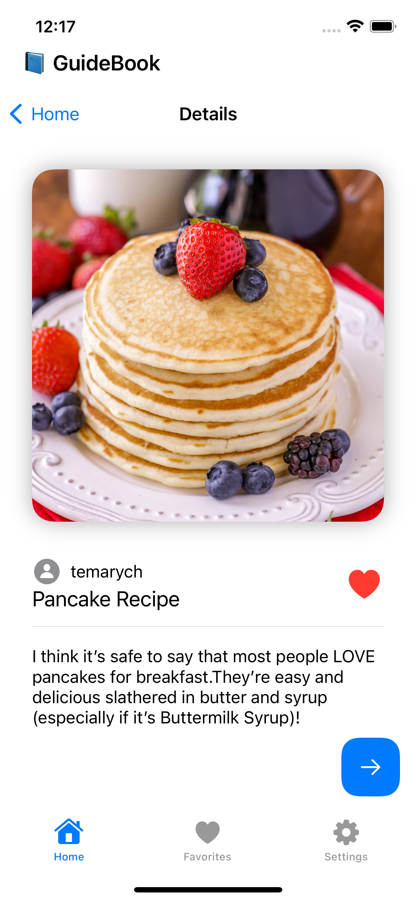

# GuideBook - iOS Додаток


## Знімки екрану

<div style="display: flex; justify-content: space-between;">
    
    
    
</div>

## Відео

https://github.com/yegormi/guidebook-ios/assets/72651640/fa99eb6c-6e0f-404d-8b03-7b9c384e6727


## Зміст

- [Вступ](#вступ)
- [Ключові функції](#ключові-функції)
- [Початок роботи](#початок-роботи)
  - [Встановлення](#встановлення)
  - [Використання](#використання)
- [Сприяння](#сприяння)
- [Ліцензія](#ліцензія)
- [Подяки](#подяки)

## Вступ

**GuideBook** - це функціональний додаток для iOS, який дозволяє користувачам досліджувати, переглядати та додавати в обране подорожні гіди. Він пропонує зручний інтерфейс, плавну навігацію та необхідну інформацію для подорожей в одному місці. Цей README надає огляд додатку, інструкції щодо встановлення та використання.

## Ключові функції

- Перегляд та дослідження подорожніх гідів.
- Додавання гідів до обраних.
- Зручний та інтуїтивно зрозумілий інтерфейс.
- Багатомедійний контент.

## Початок роботи

Слідуйте цим інструкціям, щоб скопіювати проект та запустити його на вашому пристрої для розробки та тестування.

### Встановлення

1. **Склонуйте репозиторій на свій пристрій за допомогою Git:**
```shell
git clone https://github.com/yegormi/guidebook-ios
```
2. **Відкрийте проект у Xcode.**
3. **Побудуйте та запустіть додаток на симуляторі iOS або фізичному пристрої.**

### Використання

- **Запустіть додаток GuideBook на своєму пристрої iOS або симуляторі.**
- **Досліджуйте список доступних гідів.**
- **Натискайте на гід, щоб переглянути його деталі.**
- **Для відзначення гіду як обраного, натискайте на іконку серця.**
- **Використовуйте функції навігації для перегляду гідів та вивчення їхніх етапів.**

### Сприяння

Ми вітаємо внесок від спільноти. Якщо ви бажаєте внести свій внесок у проект, будь ласка, дотримуйтесь наших правил участі.

### Ліцензія

Цей проект ліцензується за ліцензією MIT - див. файл LICENSE для отримання деталей.

### Подяки

- **SwiftUI** - фреймворк SwiftUI, використаний для побудови інтерфейсу користувача додатку.
- **URLSession** - використовується для здійснення мережевих запитань.
- **RestAPI** - призначений для отримання запитань.
